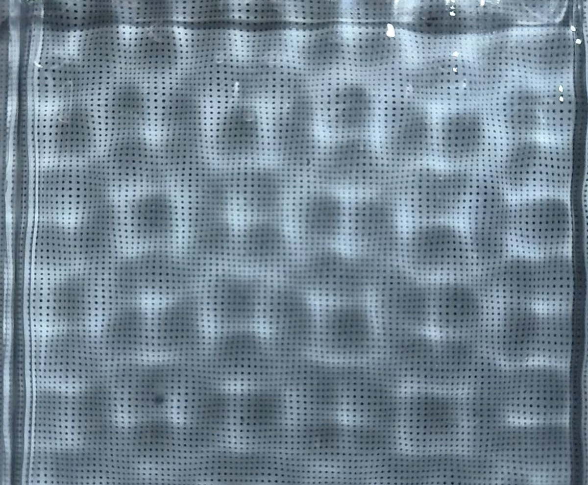
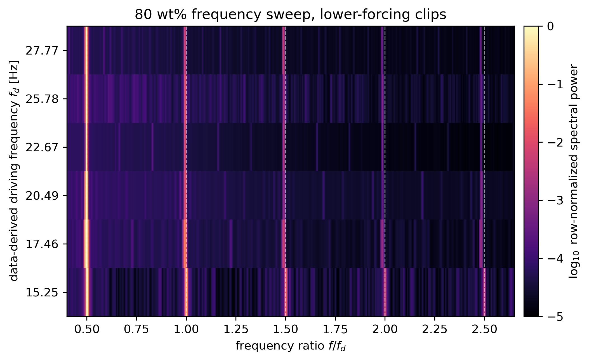
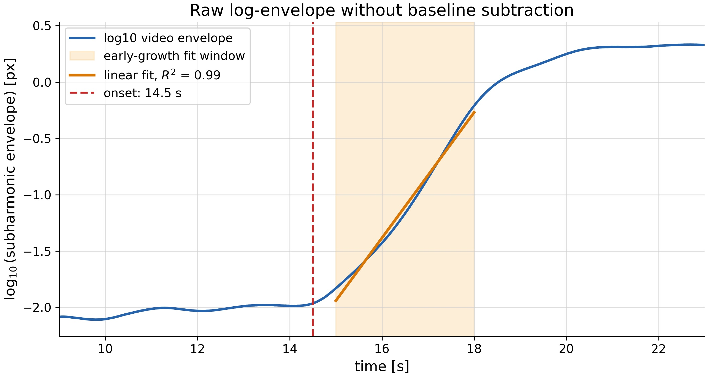
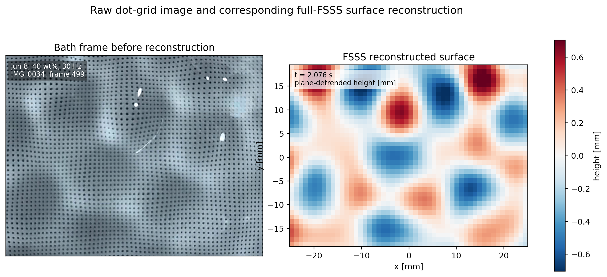
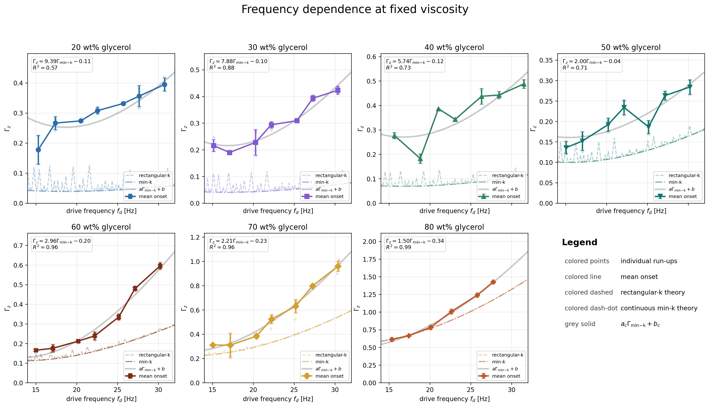

# A toolkit for analysing Faraday waves

## Motivation


The code in this repo was developed with the goal of providing a simple and open-source set of tools for analysing various properties of Faraday waves: parametric standing waves generated when shaking a container vertically.

For an introduction to the vocabulary, theoretical background, as well as an intuitive and general explanation of how this repo was used, please read the research paper PDF, located in `artifacts/`.

#### Acknowledgements

First of all, I would like to say my thanks to the **University of Groningen** (Netherlands) for providing the opportunity and freedom to pursue scientific research of our choice, as a first-year bachelor project.

Secondly, I would like to thank the members of the team, namely, **Sam Bakker**, for taking care of the theoretical background, as well as coding a numerical model for accurately predicting onset acceleration curves and instability tongues (his code can be found in `notebooks/numerical_method/`); 

**Tsjeard Bron**, for analysing the results derived from our acquired data, integrating them with the theoretical background and also coding a Jupyter notebook for calculating the fluid properties of glycerol solutions and quickly using it for Faraday-wave diagnostics on wave numbers and the dispersion relation (his code can be found in `notebooks/fluid_constants_calculator/`, and an adapted version for the pipeline runner can be found in `scripts/fluid_properties/`); 

**Mihnea Marcu**, for building most of the setup, methods used in the lab, as well as 3D-modelling the constructed setup (visuals and the Blender file can be found in `artifacts/`).

Finally, I would also like to thank our TA and project advisor **Toms Ozoliņš**, for providing us feedback along the way.

---


## The workflow for using these tools

1. Place raw videos, accelerometer CSV files, and metadata under `inputs/`.

2. Select or verify the usable dot-grid ROI with the Streamlit ROI selector.

3. Run one pipeline: frequency analysis, onset estimation, or full FSSS reconstruction.

4. Read processed outputs from `outputs/`.

5. Use `paper_data/` to reproduce the processed values shown in the paper's figures.

---

## Visual examples

Images are useful in this README because the project is visual by nature.



The image above is a raw top-view frame of Faraday waves seen through the dot grid. The pipelines below turn videos like this into temporal spectra, onset-review data, and reconstructed surface-height maps.

---

### The three main pipelines

There are various properties of interest regarding Faraday waves. This repo explores three in particular:

*Frequency analysis* (at what frequencies are the waves effectively oscillating?);

*Onset acceleration estimation* (what is the minimum vertical acceleration necessary to provide to the container such that Faraday waves occur?);

*Spatial analysis / full FSSS* (what is the dominant wave number of the waves? How does it compare to the gravity-capillary dispersion relation? What do the reconstructed fluid surfaces look like?)

---

### Structure of the repo

```text

inputs/                 Raw user-provided videos, accelerometer CSV files, and metadata.

outputs/                Generated tracking, spectra, onset, and FSSS outputs.

paper_data/             Curated processed data used in the publication figures.

scripts/                Command-line analysis tools.

streamlit/              Interactive ROI and manual onset review tools.

notebooks/              Jupyter notebooks for calculation of glycerol solution's properties as well as the numerical analysis, described in the introduction of the paper.

```


---

## Pipeline Commands

Fluid-property calculation, camera calibration, frequency analysis, onset estimation, and
full FSSS are exposed through standalone command-line scripts:

```bash
python scripts/fluid_properties/glycerol_water_properties.py --input-csv inputs/fluid_properties_inputs.csv
```

```bash
python scripts/camera_calibration/calibrate_checkerboard_camera.py --metadata inputs/calibration_metadata.yaml
```

```bash
python scripts/run_pipeline.py frequency --metadata inputs/batch_metadata.yaml
```

```bash
python scripts/run_pipeline.py onset --metadata inputs/batch_metadata.yaml
```

```bash
python scripts/run_pipeline.py full-fsss --metadata inputs/batch_metadata.yaml
```

---

## Frequency analysis

Do the observed waves oscillate at half-integer multiples of the measured driving frequency?

**Main idea:** the dot grid is tracked through a stable video. For each tracked dot, the script measures displacement relative to a flat-liquid reference, subtracts global affine motion, and computes the temporal frequency spectrum of the remaining surface-related motion.

**Required inputs:**

- A stable run video.
- `inputs/calibration_metadata.yaml`, including the flat-liquid reference video and ROI.
- `inputs/batch_metadata.yaml`, listing the run videos and drive-frequency metadata.

**Command:**

```bash
python scripts/run_pipeline.py frequency --metadata inputs/batch_metadata.yaml
```

**Main outputs:**

```text
outputs/dot_tracking/frequency/runs/<project>/<drive_frequency>/<run_id>/tracking/tracked_dots_frequency.npz
outputs/frequency_analysis/runs/<project>/<drive_frequency>/<run_id>/spectrum/full_spectrum_frequency_tracks.csv
outputs/frequency_analysis/runs/<project>/<drive_frequency>/<run_id>/spectrum/half_integer_frequency_peaks.csv
outputs/frequency_analysis/runs/<project>/<drive_frequency>/<run_id>/spectrum/frequency_summary.json
```

Example output:



The vertical bands show spectral power aligning with half-integer multiples of the measured driving frequency.

---

## Onset acceleration estimation

At what shaker acceleration does the subharmonic response become experimentally visible during a run-up?

**Main idea:** a run-up video is tracked using the same frequency-style dot tracking. The video-derived subharmonic envelope is synchronized with accelerometer-derived acceleration, giving a review dataset for manual onset selection in Streamlit.

**Required inputs:**

- A run-up video.
- The run-up accelerometer CSV.
- An accelerometer calibration CSV.
- `inputs/calibration_metadata.yaml`.
- `inputs/batch_metadata.yaml`, with run-up runs marked for the onset pipeline.

**Command:**

```bash
python scripts/run_pipeline.py onset --metadata inputs/batch_metadata.yaml
```

**Manual review app:**

```bash
streamlit run streamlit/onset_selector/app.py
```

**Main outputs:**

```text
outputs/onset_estimation/runs/<project>/<drive_frequency>/<run_id>/onset_review_summary.json
outputs/onset_estimation/runs/<project>/<drive_frequency>/<run_id>/video_onset_metrics.csv
outputs/onset_estimation/runs/<project>/<drive_frequency>/<run_id>/accelerometer_gamma_metrics.csv
```

Example onset-review output:



The onset workflow generates review data where the rising subharmonic video response can be compared with the accelerometer-derived forcing envelope.

---

## Full FSSS / spatial analysis

What does the reconstructed surface look like, and what is the dominant wavelength/wave number?

**Main idea:** full free-surface synthetic schlieren (FSSS) converts apparent dot-grid displacement into local surface gradients using a ray-traced calibration. The gradients are integrated into signed height maps, and a 2D spatial Fourier transform is used to estimate the dominant wave number.

**Required inputs:**

- Checkerboard camera calibration.
- Dry dot-grid reference video.
- Flat-liquid reference video.
- Stable run video.
- Fluid, container, refractive-index, depth, and dot-grid metadata in `inputs/calibration_metadata.yaml`.
- Full-FSSS runs marked in `inputs/batch_metadata.yaml`.

**Command using existing calibration outputs:**

```bash
python scripts/run_pipeline.py full-fsss --metadata inputs/batch_metadata.yaml
```

**Command regenerating the full FSSS calibration chain first:**

```bash
python scripts/run_pipeline.py full-fsss --metadata inputs/batch_metadata.yaml --run-calibration
```

**Main outputs:**

```text
outputs/full_fsss/calibration/<calibration_id>/raytrace_fsss_calibration.json
outputs/full_fsss/runs/<project>/<drive_frequency>/<run_id>/tracking/tracked_dots_fsss.npz
outputs/full_fsss/runs/<project>/<drive_frequency>/<run_id>/reconstruction/surface_height_m.npz
outputs/full_fsss/batch/<batch_id>/wavenumber/wavenumber_summary.csv
```

Example reconstruction output:



This image shows a comparison between the captured image from the camera and the mathematically reconstructed surface

---

## Streamlit Tools

Use the ROI selector before tracking if the dot-grid region needs to be chosen or adjusted:

```bash
streamlit run streamlit/roi_selector/app.py
```

Use the onset selector after run-up onset estimation to review and save manual picks:

```bash
streamlit run streamlit/onset_selector/app.py
```

---

## Reproducing publication figures

The curated processed data used for publication figures is stored in `paper_data/`.
The figure scripts do not require raw videos.

```bash
python scripts/paper_figures/generate_all_publication_figures.py
```

Generated figures are written to `outputs/publication_figures/`.

Example publication-style onset summary:



---

## Citation

If you use this toolkit or the processed data in academic work, please cite the project using the metadata in `CITATION.cff`.

---

## License

This project is distributed under the MIT License. See `LICENSE`.
